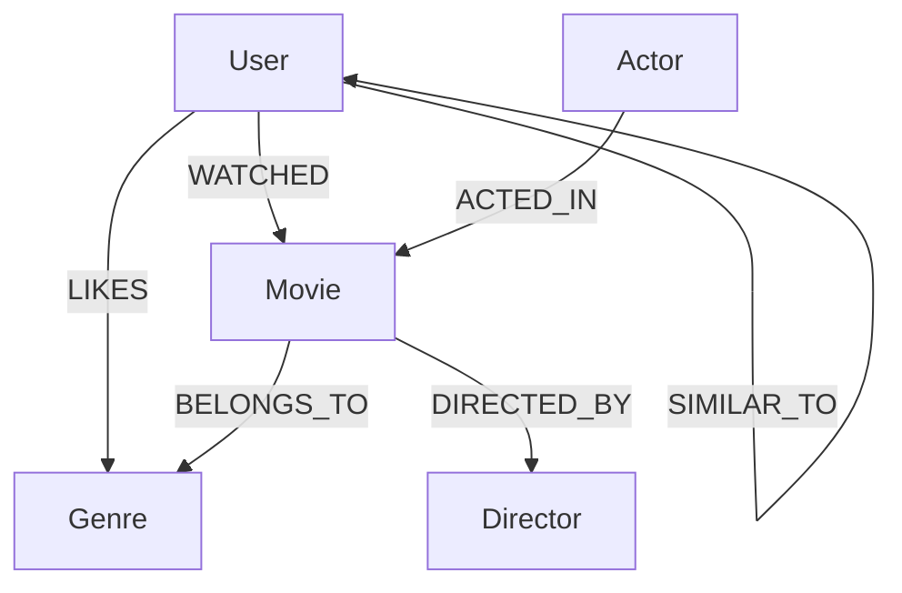

# WexaAI Movie Explorer

WexaAI Movie Explorer is a graph-powered movie discovery app built on CognoDB Cloud. It lets a user browse movies, inspect a movie's connected neighborhood, and switch between different viewers to see personalized recommendations based on shared watch history.

The project was designed for the WexaAI CognoDB take-home assignment and demonstrates why graph databases are a natural fit for connected-data problems.

## Project Overview

The app tells a simple story:

- users watch movies
- movies belong to genres
- movies are directed by directors
- movies are acted in by actors
- recommendations emerge from the relationship graph rather than from table joins

The UI includes:

- a movie browser with title/genre search
- a selected movie detail panel
- a graph visualization of the selected movie's neighborhood
- a user selector for personalized recommendations
- polished loading, empty, and error states

## Why a Graph Database?

This project benefits from a graph database because the interesting questions are about relationships.

Examples:

- Which movies are connected to the same actors and director?
- What should a user watch next based on other users with overlapping watch history?
- Which movies live in the same connected neighborhood of genres, cast, and taste?

These kinds of questions become awkward in a relational schema because they require multiple joins across watch history, movie metadata, cast, genres, and user similarity. In a graph database, those same questions become natural traversals.

## Tech Stack

- Frontend: React + Vite
- Backend: Node.js + Express
- Database: CognoDB Cloud
- Driver: Neo4j JavaScript Driver
- Styling: Custom CSS

## Features

- browse seeded movies
- search by movie title or genre
- open a movie detail view
- see actor, director, and genre connections visually
- switch between users to change recommendations
- handle loading, empty, and database error states

## Data Model

The app uses a small but meaningful graph model.

### Mermaid Diagram



### Nodes

- `User`
  - `id`
  - `name`
- `Movie`
  - `id`
  - `title`
  - `year`
  - `rating`
  - `synopsis`
- `Actor`
  - `id`
  - `name`
- `Director`
  - `id`
  - `name`
- `Genre`
  - `id`
  - `name`

### Relationships

- `(User)-[:WATCHED {rating}]->(Movie)`
- `(User)-[:LIKES]->(Genre)`
- `(Movie)-[:BELONGS_TO]->(Genre)`
- `(Movie)-[:DIRECTED_BY]->(Director)`
- `(Actor)-[:ACTED_IN]->(Movie)`
- `(User)-[:SIMILAR_TO {sharedWatched}]->(User)`

## Seed Data

The repo includes a seed script at:

- [backend/seed/seed-movies.js](backend/seed/seed-movies.js)

It currently loads:

- 6 users
- 8 movies
- 10 actors
- 6 directors
- 6 genres
- 18 watch relationships

It also creates similarity edges based on overlapping watch history so the graph contains reusable connected data.

## Main Queries

The backend is intentionally small and readable. The key queries are in:

- [backend/src/services/movieService.js](backend/src/services/movieService.js)

### 1. Movie List Query

Used by `GET /api/movies`.

What it does:

- fetches all movies
- optionally collects genre names
- orders by rating and year

Why it matters:

- powers the main movie browser
- gives the user a clean entry point into the graph

### 2. Movie Detail Query

Used by `GET /api/movies/:movieId`.

What it does:

- finds one movie by id
- collects its actors
- finds its director
- collects its genres

Why it matters:

- powers the selected movie panel
- shows the connected neighborhood around one movie

### 3. Recommendation Query

Used by `GET /api/movies/recommendations/:userId`.

What it does:

- finds the selected user's watched movies
- finds other users who share at least one watched movie
- recommends movies those similar users watched
- excludes movies the current user has already watched
- orders by support, rating, and year

Why it matters:

- demonstrates a graph-native recommendation flow
- shows a multi-hop traversal over user -> movie -> user -> movie

### 4. Graph Neighborhood Query

The graph visualization is built from the movie detail payload returned by the movie detail query.

It visualizes:

- the selected movie
- its director
- its genres
- its actors

This makes the connected structure visible without needing a separate graph API.

## Project Structure

```text
WexaAI/
  backend/
    src/
      app.js
      server.js
      config/
      db/
      middleware/
      routes/
      services/
    seed/
      seed-movies.js
    docs/
      movie-schema.md
  frontend/
    src/
      App.jsx
      components/
      lib/
      styles.css
```

## Setup

### Prerequisites

- Node.js
- A CognoDB Cloud account
- A free CognoDB instance

### Environment Variables

Create a `.env` file in the project root:

```env
COGNODB_URI=bolt+s://your-instance-id.databases.cognodb.com
COGNODB_USER=cognodb
COGNODB_PASSWORD=your_password_here
FRONTEND_ORIGIN=http://127.0.0.1:5173
```

### Backend

```bash
cd backend
npm install
npm run dev
```

### Seed the Database

```bash
cd backend
npm run seed
```

### Frontend

```bash
cd frontend
npm install
npm run dev
```

## Running the App

- Backend: `http://localhost:5000`
- Frontend: `http://127.0.0.1:5173`

## Deployment

The simplest deployment path is:

- backend on Render, Railway, or any Node host
- frontend on Vercel or Netlify

### Backend deployment

Set these environment variables on the backend host:

```env
COGNODB_URI=bolt+s://your-instance-id.databases.cognodb.com
COGNODB_USER=cognodb
COGNODB_PASSWORD=your_password_here
FRONTEND_ORIGIN=https://your-frontend-domain
PORT=5000
```

Use the backend start command:

```bash
npm start
```

### Frontend deployment

Set this environment variable on the frontend host:

```env
VITE_API_BASE_URL=https://your-backend-service-url
```

Use the frontend build command:

```bash
npm run build
```

### After deployment

- Open the frontend URL
- Confirm the movie list loads
- Switch users and confirm recommendations update
- Open a movie and confirm the graph panel loads
- Check `GET /api/health` on the backend URL

## API Endpoints

- `GET /api/health`
- `GET /api/movies`
- `GET /api/movies/:movieId`
- `GET /api/movies/recommendations/:userId`

## Screenshots

Add screenshots of:

- landing page
- movie browser
- selected movie detail
- graph visualization
- recommendations for different users

## Hosted Demo

- Demo link: `ADD_LINK_HERE`

## Screen Recording

- Recording link: `ADD_LINK_HERE`

## Repository

- Public GitHub repo: `ADD_LINK_HERE`

## Notes

- The app uses parameterized Cypher only.
- The backend keeps the database connection details in environment variables.
- The CognoDB instance should stay running for review.
- The project is intentionally small, explainable, and interview-friendly.
